**POROČILO:**

**Pridobivanje in čiščenje podatkov:**

Za našo analizo smo se najprej lotili zbiranja podatkov s spletne strani [vsikatalogi.si](https://vsikatalogi.si), kjer smo uporabili oba glavna vira: [akcije](https://vsikatalogi.si/akcije) in [vikend-akcije](https://vsikatalogi.si/vikend-akcije). Celoten postopek pridobivanja podatkov je natančno opisan in dokumentiran v datoteki scraping.ipynb.

Iz tega procesa smo najprej pridobili dve surovi CSV datoteki:

vsikatalogi_scraped.csv
vikend_akcije_scraped.csv

Ker so bili podatki v začetni obliki precej "neurejeni", smo jih morali dodatno očistiti in standardizirati. To smo naredili s posebnimi skriptami, kjer smo odstranili nepotrebne znake, popravili zapise trgovin, datume in cene ter očistili imena izdelkov. Tako smo dobili datoteki:

vsikatalogi_ready.csv
vikend_akcije_ready.csv

Ker sta bili strukturi obeh datotek enaki, smo ju lahko brez težav združili v eno skupno datoteko:

vse_cene.csv

S tem pa se je delo šele začelo. V datoteki urejanje_tabel.ipynb smo se lotili še bolj poglobljenega čiščenja in priprave podatkov za analizo. Najprej smo odstranili osamelce oziroma izdelke, ki so se pojavljali le izjemoma (v zadnjih kvartilih), torej smo se odstranili izdelkov, ki so imeli absurdne cene. Pri čiščenju se je pojavil tudi problem različnih zapisov za iste izdelke (npr. "Naravne banane" in "Rumene banane"), zato smo uporabili knjižnico rapidfuzz, ki nam je pomagala podobne izdelke združiti v skupine. Čeprav rezultat ni bil popoln, je bistveno izboljšal konsistentnost podatkov.

Na koncu smo tako dobili dve glavni datoteki za analizo:

vse_cene_grouped.csv
vse_cene_grouped_top6.csv  (zakaj top 6 kasneje)

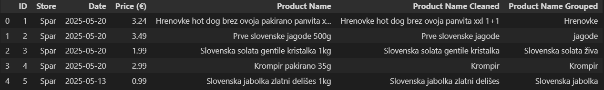

Za uravnovešenje cen skozi leta in pošteno primerjavo med trgovinami smo uporabili še indeks spremembe cen glede na leto 2015, ki smo ga pridobili s spletne strani SURS in Eurostat. Iz teh virov smo pripravili še dodatne datoteke:

EU-indeksi.csv
podatki/SLO-cene.csv
podatki/razmerje_cen.csv

***Analiza:**
Aalizo smo spremenili na dva dela, in to sicer na del z izdelki in cenami in del z trgovinami.

Interpretacija analize:

**DEL Z IZDELKI**

Analiza cen izdelkov skozi čas nam je pokazala več zanimivih trendov:

Stabilnost cen osnovnih izdelkov:

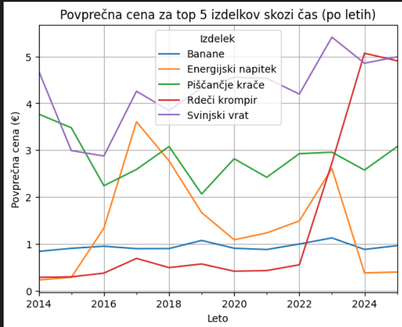

Pri nekaterih izdelkih, kot so banane, smo opazili izjemno stabilnost cene skozi več let, kar kaže na močno konkurenco in dobro reguliran trg za osnovne prehrambne izdelke.

Rast cen posameznih izdelkov:
Pri drugih izdelkih, kot je rdeči krompir, je bila zaznana izrazita rast cene, kar lahko pripišemo bodisi sezonskim vplivom, spremembam v ponudbi/povpraševanju ali zunanjim dejavnikom (npr. podražitve surovin).

Najdražji in najcenejši izdelki v polletjih:

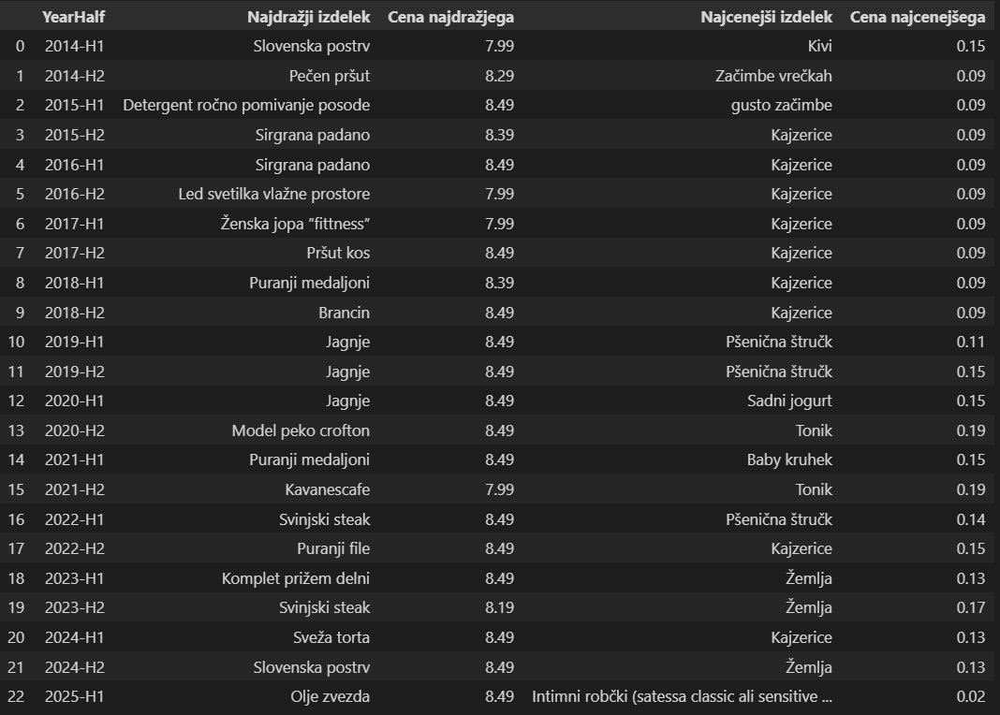

S spremljanjem najvišjih in najnižjih cen v vsakem polletju smo lahko identificirali izdelke, ki so pogosto izstopali kot najdražji ali najcenejši. Zanimivo je, da so se nekateri izdelki (npr. kajzerica) več let zapored pojavljali kot najcenejši, kar kaže na njihovo vlogo kot "cenovni magnet" za kupce.

Največje spremembe cen:

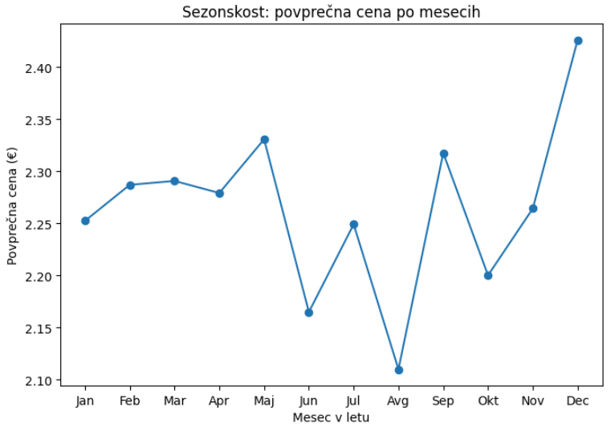

Analiza izdelkov z največjimi povprečnimi spremembami cene je razkrila, da so to pogosto izdelki, ki so podvrženi akcijam ali sezonskim nihanjem. Ti izdelki so za trgovce pogosto orodje za privabljanje kupcev ali uravnavanje zalog.

Segmentacija cen:

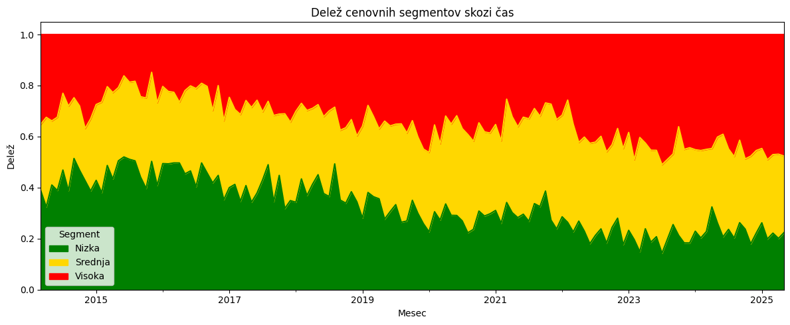

S segmentacijo izdelkov v cenovne razrede (nizka, srednja, visoka) smo ugotovili, da se delež izdelkov v posameznem segmentu skozi čas spreminja. V določenih obdobjih je opaziti premik proti dražjim ali cenejšim izdelkom, kar lahko odraža širše gospodarske trende ali spremembe v ponudbi.

**DEL S TRGOVINAM**

Primerjava izdelkov med trgovinami:

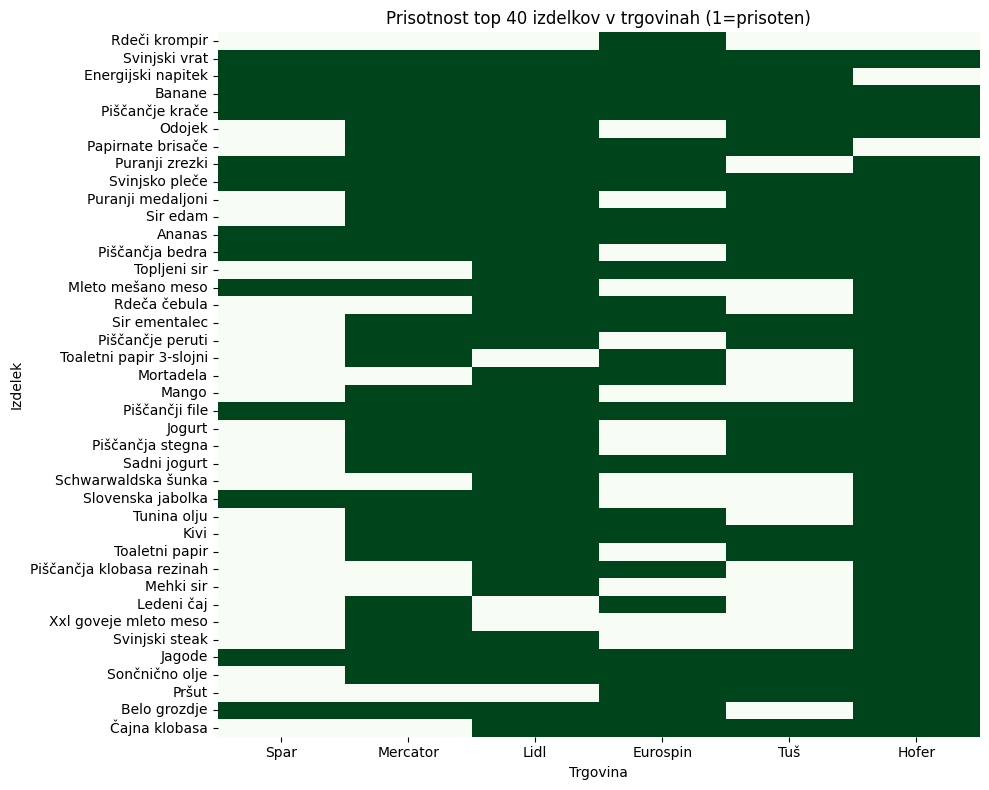

Zaradi omejene količine podatkov smo se osredotočili na največkrat omenjene trgovine (top 6 - Mercator, Hofer, Lidl, Spar, Tuš in Eurospin) in izdelke, ki se pojavljajo v več trgovinah. S tem smo omogočili neposredno primerjavo cen in ponudbe med največjimi trgovci.

Vennovi diagrami:

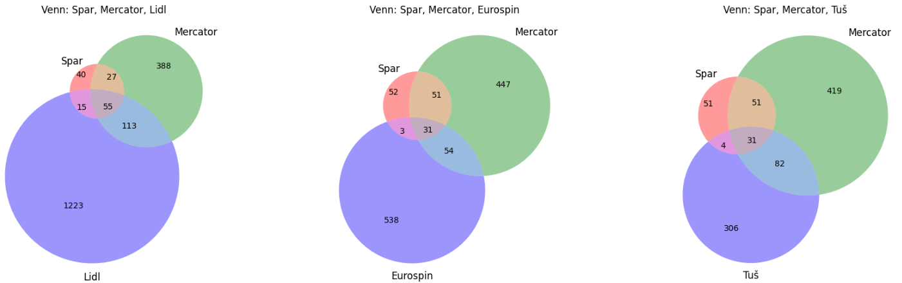

Analiza prekrivanja izdelkov med trgovinami s pomočjo Vennovih diagramov je pokazala, da obstaja precejšnje število izdelkov, ki so prisotni v več trgovinah, a je hkrati tudi veliko unikatnih izdelkov, ki jih ponuja le ena trgovina.

Heatmap cen:

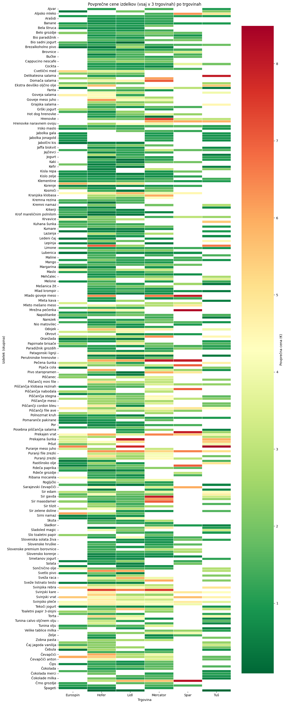

Toplotni zemljevid (heatmap) cen izdelkov po trgovinah je razkril, da so razlike v cenah med trgovinami lahko precejšnje, še posebej pri izdelkih, ki so prisotni v vsaj treh trgovinah. Nekatere trgovine so pogosto najcenejše, druge pa izstopajo z višjimi cenami.

Povprečne cene in delež najcenejših izdelkov:

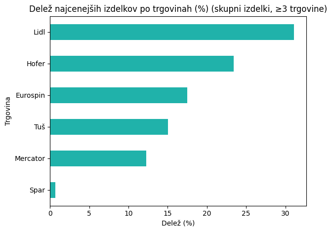

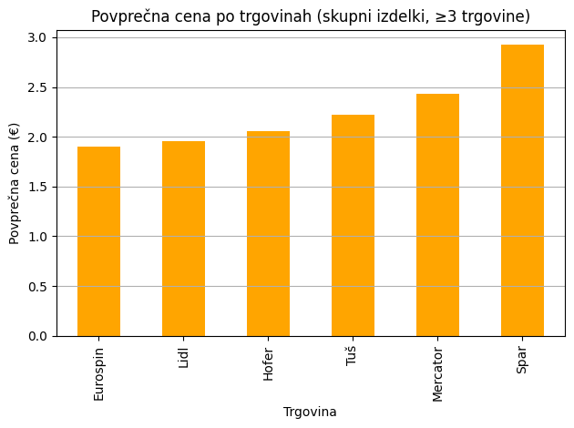

Z analizo povprečnih cen in deleža najcenejših izdelkov po trgovinah smo ugotovili, da ni nujno, da je ena trgovina vedno najcenejša – pogosto se najcenejši izdelki porazdelijo med več trgovin, kar kaže na dinamično cenovno politiko.

Inflacija in primerjava skozi čas
Upoštevanje inflacije:

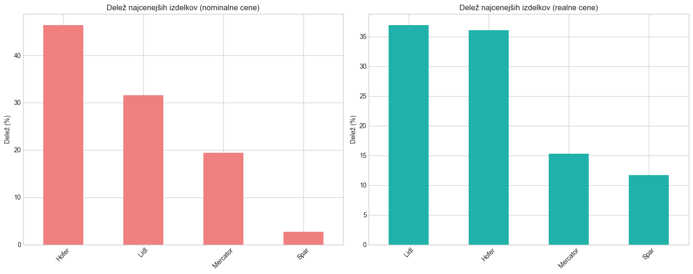

Za pošteno primerjavo cen skozi leta smo cene prilagodili z inflacijskim indeksom. S tem smo lahko ugotovili, ali so se realne cene izdelkov resnično spreminjale ali pa so spremembe posledica splošne rasti cen v gospodarstvu.

Primerjava z uradnimi podatki:

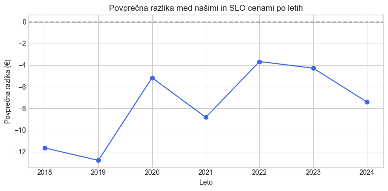

Na koncu smo naše podatke primerjali še z uradnimi podatki SURS in Eurostat. Ugotovili smo, da so naše povprečne cene v večini primerov zelo blizu uradnim, kar potrjuje zanesljivost našega pristopa in kakovost zbranih podatkov.

**Napovedovanje prihodnjih cen:**
Na podlagi zgodovinskih podatkov in z upoštevanjem sezonskih nihanj smo pripravili tudi napoved gibanja povprečnih cen za naslednjih pet let. Uporabili smo model linearne regresije, ki poleg dolgoročnega trenda upošteva tudi tipične mesečne vzorce (npr. višje cene v decembru). Rezultati napovedi kažejo, da lahko pričakujemo postopno rast cen, pri čemer bodo mesečna nihanja še naprej prisotna. Podobno smo pripravili tudi napovedi za posamezne kategorije izdelkov, kjer so razlike med kategorijami še bolj izrazite – nekateri segmenti bodo rasli hitreje, drugi počasneje ali celo ostali stabilni. Takšna napoved je lahko v pomoč tako potrošnikom kot trgovcem pri načrtovanju prihodnjih nakupov in strategij.

Sklep:
Analiza je pokazala, da je trg živil v Sloveniji zelo dinamičen, z veliko konkurenco in pogostimi akcijami. Kljub temu pa so določeni izdelki in trgovine skozi čas ohranjali stabilnost ali celo prednost v cenah. Pristop, ki združuje avtomatsko zbiranje podatkov, napredno čiščenje in primerjavo z uradnimi viri, se je izkazal za zelo učinkovitega pri razumevanju dogajanja na trgu.
